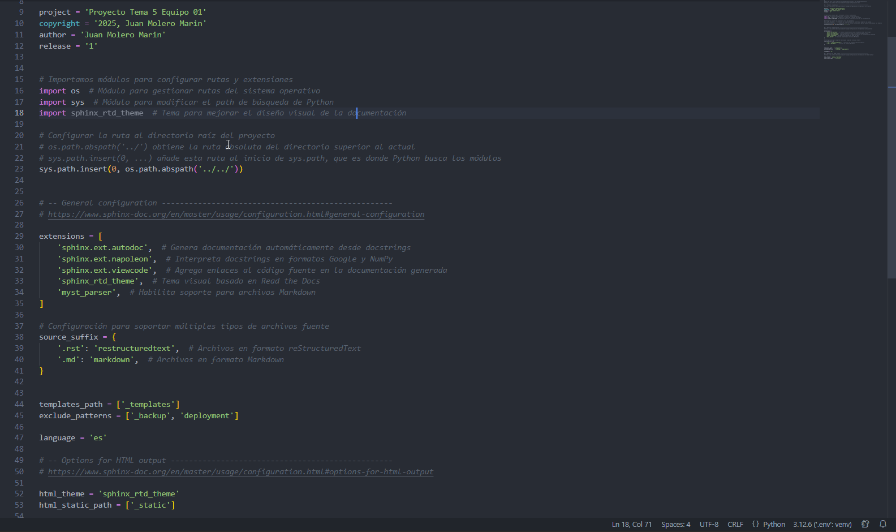

# 1.5. Explicación de conf.py 

Nuestro archivo de configuración principal sería el siguiente: 

----------

**Parámetros del archivo de configuración:**

| **Parámetro**                          | **Descripción**                                                                                                                                                  |
|----------------------------------------|------------------------------------------------------------------------------------------------------------------------------------------------------------------|
| **1. project**                         | Indica el nombre del proyecto.                                                                                                                                  |
| **2. copyright**                       | Se indicará una licencia en caso de querer establecerla.                                                                                                        |
| **3. author**                          | Autor(es) que han realizado el proyecto.                                                                                                                        |
| **4. release**                         | Versión del proyecto. En este caso, es la **1** porque se estableció anteriormente.                                                                              |
| **5. Importaciones necesarias**        | Módulos **os** y **sys**, necesarios para el manejo de rutas, y el tema de Sphinx que se va a emplear.                                                           |
| **6. Extensiones**                     | Se utilizarán: **autodoc**, **napoleon** para docstring, **viewcode** para enlaces al código fuente, **sphinx_rtd_theme** y **myst_parser** para soportar Markdown.|
| **7. Otras configuraciones importantes**| Uso de **source_suffix** para soportar archivos fuente (**rst** y **md**). Configuración del idioma y las rutas hacia los directorios **_static** y **_templates**. |

