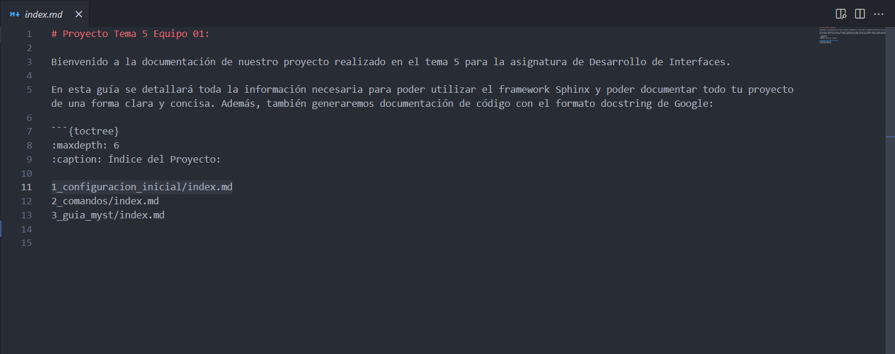

# 1.6. Explicacion del archivo index.md

Nuestro archivo index.md va a representar el índice principal dentro de la Aplicación. En él, hemos incluido una breve descripción del proyecto también. Lo podemos observar a continuación: 

En este archivo podemos observar los siguientes elementos: 

**1. Titulo Principal del Proyecto** 

----------

**2. Indice que nos irá redirigiendo a cada uno de los apartados que se deben de explicar:** cabe destacar que dichos apartados/directorios poseen sus respectivos indices, que nos volverán a redirigir a nuevos archivos **Markdown** donde ya se explicará el contenido.

----------

**3.Elemento Caption:** nos ofrece una cabecera descriptiva para el proyecto. Se ha empleado justo antes de la generación del índice.

----------

**4.Elemento Maxdepth:** elemento que nos define el nivel de profundidad que podrá adquirir nuestro árbol en cuanto a directorios y subdirectorios. En nuestro caso, hemos definido el nivel 6 o nivel 2 en otros índices posteriores.

----------

El resto de elementos que podemos observar dentro de la página es **texto plano**, en el cual podemos plasmar la información deseada.

