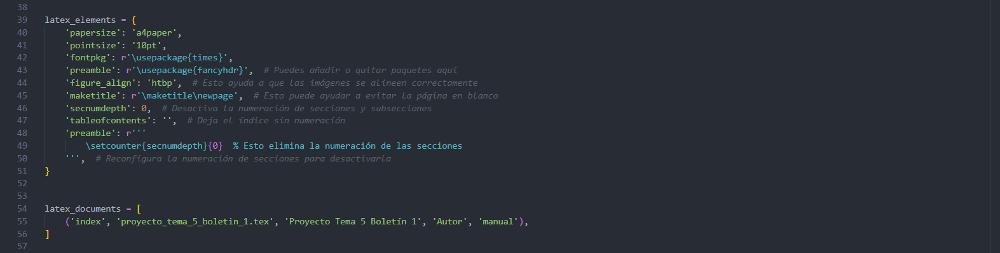

# 1.9. Generación de PDF a partir de la documentación:

Para la generación de archivos PDF, en nuestro caso hemos escogido el sistema que emplea la tipografía LaTeX, mediante la cual gracias a un intérprete vamos a poder generar archivos en formato **.tex**, que posteriormente se compilarán en documentos **PDF** con una apareriencia profesional. Para ello, el primer paso será tener una distribución de TeX propiamente instalada dentro del equipo donde se quiera realizar esta tarea. Es por eso que en nuestro caso hemos decidido instalar **MiKTeX**. El proceso de instalación será el siguiente: 

**1. Buscamos MiKTeX en nuestro navegador e indicamos en que parte del sistema deseamos instalarlo**

----------

**2. Al instalarlo, abriremos posteriormente su consola para actualizarlo y agregaremos los paquetes de latexpdf necesarios para generar nuestros documentos**

----------

**3. Finalmente, indicaremos al Sistema Operativo mediante la modificación de la Variable del Sistema Path la ruta de instalación de MiKTeX, con la finalidad de que se reconozca posteriormente el comando que tenemos que emplear**

----------

Tras realizar todos estos pasos, es momento de dirigirnos a nuestro proyecto y comenzar a generar la documentación. Para eso ejecutaremos el siguiente comando: 

~~~
.\make.bat clean; .\make.bat latexpdf
~~~

| **Comando**            | **Explicación**                                                                                                                                         |
|------------------------|-----------------------------------------------------------------------------------------------------------------------------------------------------|
| **.\make.bat clean**    | Ejecuta el script `make.bat` con la opción `clean`, lo que significa que limpia cualquier archivo o compilación previa en el proyecto, eliminando archivos generados anteriormente. |
| **.\make.bat latexpdf**   | Ejecuta el script `make.bat` con la opción `latexpdf`, que compila la documentación en formato LaTeX y la convierte en un archivo PDF.                 |

Al ejecutar el comando, la carpeta build de nos reestructurará y se nos generará el archivo PDF correspondiente dentro del subdirectorio **/latex**

----------

**IMPORTANTE**

- Al generar esta nueva estructura, se nos ha regenerado el directorio, por lo cual ya no dispondremos de la documentación en el formato **HTML** como en el apartado anterior, por lo que si queremos volver a tenerla tendremos que ejecutar: 

~~~
.\make.bat clean; .\make.bat html
~~~

| **Comando**               | **Explicación**                                                                                                                                         |
|------------------------|-----------------------------------------------------------------------------------------------------------------------------------------------------|
| **.\make.bat clean**     | Ejecuta el script `make.bat` con la opción `clean`, lo que significa que limpia cualquier archivo o compilación previa en el proyecto, eliminando archivos generados anteriormente. |
| **.\make.bat html**      | Ejecuta el script `make.bat` con la opción `html`, que compila la documentación en formato HTML y la convierte en un archivo HTML.                   |

----------

- Para que el formato **PDF** salga con el formato deseado y con el fin de evitar errores, como duplicación de páginas en blanco o de índices en la numeración, se ha tenido que agregar la siguiente configuración dentro del archivo **conf.py**:

